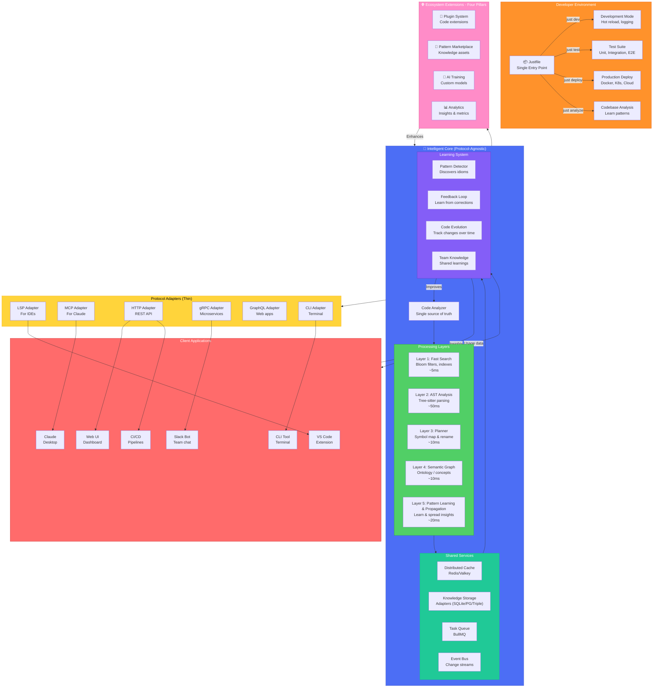

---
cssclasses:
---
# Ontology-LSP Vision: The Intelligent Programming Companion

## Executive Summary

Ontology-LSP transforms code understanding from passive analysis to active intelligence. It's a system that learns your coding patterns, understands your architectural decisions, and amplifies your capabilities through every tool you use - starting with Claude and VS Code.

## Core Philosophy: Your Code's Living Memory

From first principles, code understanding is about **relationships, patterns, and evolution**. The system should be a living, learning entity that grows smarter with every interaction - becoming your team's collective programming intelligence.

## Architecture: One Brain, Many Interfaces



## Refined Path Forward (AST+SCIP default, LSP as booster)

We keep the protocol‑agnostic core and adopt a hybrid strategy tailored to LLM workflows:

- Default router: AST + symbol/xref graph for read/nav/plan; p95 < 100ms.
- Offline precision: optional SCIP/LSIF indices for TS/Py to answer defs/refs without a running server.
- LSP booster: narrow, feature‑flagged use for typed rename/implementations when inference is required; strict budgets and circuit‑breakers.
- Snapshot‑aware MCP HTTP tools: all reads/searches/edits reference a snapshot (git HEAD + overlay); all edits are diffs that pass format/lint/typecheck/tests before acceptance.

### LLM‑Friendly Tool Surface (MCP HTTP)
- get_snapshot → snapshot id
- text_search(query, glob?, kind=literal|regex|word, case?, limit?, context?, snapshot)
- symbol_search(query, lang?, path_hint?, limit?, snapshot)
- ast_query(language, query, paths?, glob?, snapshot)
- graph_expand(symbol|file, edges=[callers|callees|imports|exports], depth?, limit?, snapshot)
- read_file(path, range?, snapshot)
- find_definition / find_references(symbol?, path?, snapshot)
- propose_patch(diff, format="unified", run_checks?, snapshot) and run_checks(commands?, snapshot)

These replace ad‑hoc shelling to grep/ls/sed with bounded, deterministic operations.

## Layer Salvage Summary (What we reuse today)

- Layer 1: Fast Search
  - Keep `src/layers/layer1-fast-search.ts` (ripgrep‑backed, async streaming grep, glob/ls, bloom‑filter hints, caching, budgets).
  - Expose via `text_search` + default ignore sets; maintain confidence scoring and result caps.

- Layer 2: AST Analysis (Tree‑sitter)
  - Keep `src/layers/tree-sitter.ts` and `core/unified-analyzer.ts` AST passes (queries for identifiers/functions/classes/imports/calls; file budget + relevance ranking).
  - Expose via `ast_query` and `list_symbols`; use to validate defs/refs and rename plans.

- Layer 3: Planner (Symbol Map + Rename Planning)
  - Keep `core/unified-analyzer.ts:buildSymbolMap(...)` and promote to a first‑class API.
  - Maintain a small `PlannerLayer` for metrics/health; time `buildSymbolMap` and `planRename` with LayerManager.

- Layer 4: Ontology / Semantic Graph
  - Keep `core/services/ontology-engine.ts` and `core/services/storage.ts` behind StoragePort; gate enrichment by config and budgets.
  - Use for concept lookups/relations when helpful; do not place on hot read/nav paths.

- Layer 5: Pattern Learning & Propagation
  - Keep `core/services/pattern-learner.ts`, `confidence-calculator.ts`, `propagation-rules.ts`, `knowledge-spreader.ts`.
  - Use to learn rename/token patterns and propose suggestions; gate by config; attribute time to L5.

## Implementation Phases (Updated)

1) Phase A: Code Brain + MCP (1–2 weeks)
   - Implement the MCP HTTP tool surface above with OpenAPI, backed by L1/L2/L3.
   - Add snapshot/overlay store; all calls require snapshot after the first.
   - Metrics: p50/p95/p99 by op and backend; error budgets; routing ratios.

2) Phase B: Offline SCIP/LSIF (1–2 weeks)
   - Add `scip-typescript` and `scip-python` in CI; prefer for defs/refs when fresh; mark staleness; overlay deltas per branch.

3) Phase C: LSP Booster (TS typed‑rename) (1 week)
   - Pool server per (lang, root, config); TTL; strict timeouts; circuit‑breaker; AST/SCIP post‑validation before accepting edits.

## Why This Delivers
- Serves LM needs first (precise reads, scoped nav, safe edits) without keeping heavy servers in the hot path.
- Retains your investments in L1–L5 while narrowing their usage to maximize latency/cost/accuracy trade‑offs.
- Keeps adapters thin and contracts explicit; StoragePort ensures pluggable persistence for L4.

## System Design Principles

### 1. Protocol-Agnostic Core
The intelligent core doesn't know or care about protocols. It provides pure functionality that adapters translate:

```typescript
interface CodeAnalyzer {
  findDefinition(symbol: string): Promise<Definition[]>
  findReferences(symbol: string): Promise<Reference[]>
  suggestRefactoring(code: string): Promise<Suggestion[]>
  learnPattern(pattern: Pattern): Promise<void>
}
```

### 2. Progressive Enhancement Layers
Each layer adds sophistication while maintaining speed targets:
- **Layer 1** (5ms): Bloom filters, inverted indexes - instant results
- **Layer 2** (50ms): AST parsing - structural understanding
- **Layer 3** (10ms): Symbol map & planner
  
- **Layer 4** (10ms): Concept graph - semantic relationships
- **Layer 4** (10ms): Semantic graph - ontology concepts
  
- **Layer 5** (20ms): Pattern learning & propagation
- **Layer 5** (20ms): Knowledge spreading - insight propagation

### 3. Learning-First Architecture
Every interaction teaches the system:
- Accepted suggestions strengthen patterns
- Rejected suggestions weaken patterns
- Refactorings create new patterns
- Code reviews validate patterns

## Developer Experience

### The Justfile: Your Command Center

```makefile
# Start development with hot-reload
dev:
    @echo "🚀 Starting Ontology-LSP..."
    bun run --watch src/core/server.ts

# Run complete test suite
test:
    @echo "🧪 Testing all protocols..."
    bun test

# Analyze codebase and learn patterns
analyze:
    @echo "🧠 Learning from your code..."
    bun run src/cli/analyze.ts .

# Deploy to production
deploy:
    @echo "🚢 Deploying intelligence..."
    just build
    docker build -t ontology-lsp:latest .
    kubectl apply -f k8s/production.yaml
```

### 2. Pluggable Knowledge Storage (StoragePort)
The ontology layer (L4) persists concepts, relations, representations,
and evolution via a storage abstraction:

- A `StoragePort` interface defines required operations (load/save/query,
  stats, maintenance).
- Interchangeable adapters enable operational flexibility:
  - SQLite: local, embedded storage (current baseline).
  - Postgres: relational backend with strong indexing and transactions.
  - Triple Store: RDF/OWL with SPARQL for typed relations and k-hops.
- Benefits: portability, predictable performance, and clean migrations.

Adoption paths:
- Path A: Live adapter over existing ontology DB (no migration).
- Path B: One-time ETL + optional dual-write until cutover.

### 3. Layer SLOs & Observability
Each layer has target budgets and emits signals for performance and
quality. Dashboards visualize p95/p99 latency, escalation decisions,
cache hit rate, and error rates:

- L3 (Planner): symbol map & rename planning SLOs and coverage.
- L4 (Ontology): k-hop queries and name lookup latency SLOs.
- L5 (Learning & Propagation): learning throughput and propagation
  depth/latency, with gating.

Alerts trigger on SLO breaches; events provide reasoning for decisions
(e.g., escalation).

### Daily Workflow

#### Morning Startup
```bash
$ just dev
🚀 Starting Ontology-LSP in development mode...
📊 Loading yesterday's patterns... 247 new patterns learned
🧠 Knowledge base: 15,432 concepts, 89,234 relationships
⚡ Cache warmed: 95% hit rate expected
✅ All systems operational
```

#### During Development
The system actively assists as you code:
- **Autocomplete** based on team patterns
- **Instant refactoring** suggestions
- **Architecture violations** caught immediately
- **Similar code** found across projects

#### Code Review
```bash
$ just analyze --pr
🔍 Analyzing pull request #1234...

✅ Patterns Followed: 12/12
⚠️  Suggestions:
  - Consider error handling pattern from auth.service.ts
  - This logic exists in 3 places - extract to utility?
  
🎯 Quality Score: 94/100
📈 Improves consistency by +2.3%
```

## Ecosystem Extensions: The Four Pillars

The Ecosystem Extensions create a self-reinforcing knowledge economy through four interconnected pillars. Each pillar serves a distinct purpose while synergistically enhancing the others. For complete architectural details, see [[ECOSYSTEM_ARCHITECTURE]].

### 1. Plugin System - Code Extensions
**What**: Executable code that extends core functionality through sandboxed runtime environments  
**Value**: Add new features, language support, protocol adapters, and integrations  
**Examples**: Rust language parser, GitHub integration, security scanner  
**Details**: [[PLUGIN_ARCHITECTURE]]

### 2. Pattern Marketplace - Knowledge Assets  
**What**: Learned patterns as tradeable data assets (JSON/YAML, not executable code)  
**Value**: Transform team knowledge into intellectual property that can be shared or sold  
**Examples**: Error handling patterns, architectural blueprints, refactoring recipes  
**Details**: [[PATTERN_MARKETPLACE]]

### 3. AI Training - Custom Intelligence
**What**: Dataset generation from your codebase to train team-specific models  
**Value**: AI that understands your domain, architecture, and coding style  
**Examples**: Custom completion models, naming conventions, code style enforcement  
**Details**: [[AI_TRAINING_PIPELINE]]

### 4. Analytics - Insights & Metrics
**What**: Comprehensive code health and team performance measurement  
**Value**: Data-driven decisions, early problem detection, productivity tracking  
**Examples**: Technical debt tracking, velocity metrics, quality scores  
**Details**: [[ANALYTICS_SYSTEM]]

### The Synergistic Effect
Each pillar enhances the others in a continuous improvement cycle:
- **Plugins** discover patterns → Feed the **Pattern Marketplace**
- **Patterns** provide training data → Improve **AI Models**
- **AI** generates insights → Enhance **Analytics**
- **Analytics** identify gaps → Drive new **Plugin** development

This creates a compound effect where knowledge accumulates, value increases exponentially, and expertise becomes democratized across the entire ecosystem.

## Impact: Second to Fifth Order Effects

### Second Order (Immediate)
- **Consistent behavior** across all interfaces
- **Shared learning** benefits all users
- **Resource efficiency** from unified architecture
- **Simplified maintenance** with single codebase

### Third Order (Team-Wide)
- **Knowledge compounds** - juniors code like seniors
- **Architectural consistency** enforced automatically
- **Reduced onboarding** - system teaches new developers
- **Cross-project insights** - patterns transfer between codebases

### Fourth Order (Organizational)
- **Industry best practices** shared via marketplace
- **Custom AI models** trained on your patterns
- **Predictive refactoring** - issues fixed before they occur
- **Pattern economy** - valuable patterns become assets

### Fifth Order (Industry)
- **Intent-based coding** - describe what, not how
- **Self-improving code** - automatic optimization
- **Democratized expertise** - everyone codes at expert level
- **Accelerated innovation** - ideas to production faster

## Implementation Roadmap

### Phase 1: Foundation (Weeks 1-2)
Fix the current architectural split:
- Unify duplicate implementations
- Create protocol-agnostic core
- Build thin adapters

### Phase 2: Intelligence (Weeks 3-4)
Add learning capabilities:
- Pattern detection engine
- Feedback loop system
- Knowledge persistence

### Phase 3: Scale (Weeks 5-6)
Enable team features:
- Distributed caching
- Pattern sharing
- Team analytics

Add pluggable storage:
- Extract SQLite adapter; add Postgres and Triple Store adapters.
- Migrations, versioning, observability, and SLO dashboards.

### Phase 4: Ecosystem (Weeks 7-8)
Build community:
- Plugin system - See [[PLUGIN_ARCHITECTURE]]
- Pattern marketplace - See [[PATTERN_MARKETPLACE]]
- AI training pipeline - See [[AI_TRAINING_PIPELINE]]
- Analytics system - See [[ANALYTICS_SYSTEM]]
- Public API

## Success Metrics

### Performance
- **Response time**: <100ms for 95% of requests
- **Cache hit rate**: >90%
- **Learning accuracy**: >85% pattern prediction

### Adoption
- **Developer satisfaction**: >4.5/5 rating
- **Time saved**: >30% reduction in coding time
- **Pattern reuse**: >50% of new code uses learned patterns

### Quality
- **Bug reduction**: 40% fewer production issues
- **Consistency score**: >90% across codebase
- **Onboarding time**: 50% faster for new developers

## The Vision Realized

Ontology-LSP becomes your team's **collective programming intelligence**:

1. **It understands** your code at a semantic level
2. **It learns** from every decision you make
3. **It shares** knowledge across your organization
4. **It evolves** with your architecture
5. **It amplifies** every developer's capabilities

This isn't just tooling - it's the future of intelligent software development. A system that makes every developer more effective, every codebase more maintainable, and every team more collaborative.

The code becomes self-documenting, self-improving, and self-teaching. Your patterns become your competitive advantage. Your knowledge becomes your legacy.

**This is programming augmented by intelligence. This is Ontology-LSP.**
