---
cssclasses:
---
# Ontology-LSP Vision: The Intelligent Programming Companion

## Executive Summary

Ontology-LSP transforms code understanding from passive analysis to active intelligence. It's a system that learns your coding patterns, understands your architectural decisions, and amplifies your capabilities through every tool you use - starting with Claude and VS Code.

## Core Philosophy: Your Code's Living Memory

From first principles, code understanding is about **relationships, patterns, and evolution**. The system should be a living, learning entity that grows smarter with every interaction - becoming your team's collective programming intelligence.

## Architecture: One Brain, Many Interfaces

```mermaid
graph TB
  subgraph DEVENV["Developer Environment"]
    JUST["📦 Justfile<br/>Single Entry Point"]
    
    JUST -->|just dev| DEVMODE["Development Mode<br/>Hot reload, logging"]
    JUST -->|just test| TESTING["Test Suite<br/>Unit, Integration, E2E"]
    JUST -->|just deploy| DEPLOY["Production Deploy<br/>Docker, K8s, Cloud"]
    JUST -->|just analyze| ANALYZE["Codebase Analysis<br/>Learn patterns"]
  end

  subgraph CORE["🧠 Intelligent Core (Protocol-Agnostic)"]
    CA["Code Analyzer<br/>Single source of truth"]
    
    subgraph LAYERS["Processing Layers"]
      L1["Layer 1: Fast Search<br/>Bloom filters, indexes<br/>~5ms"]
      L2["Layer 2: AST Analysis<br/>Tree-sitter parsing<br/>~50ms"]
      L3["Layer 3: Planner<br/>Symbol map & rename<br/>~10ms"]
      L4["Layer 4: Semantic Graph<br/>Ontology / concepts<br/>~10ms"]
      L5["Layer 5: Pattern Learning & Propagation<br/>Learn & spread insights<br/>~20ms"]
    end
    
    subgraph SHARED["Shared Services"]
      CACHE["Distributed Cache<br/>Redis/Valkey"]
      DB["Knowledge Base<br/>PostgreSQL + Vector DB"]
      QUEUE["Task Queue<br/>BullMQ"]
      EVENTS["Event Bus<br/>Change streams"]
    end
    
    subgraph LEARNING["Learning System"]
      PATTERNS["Pattern Detector<br/>Discovers idioms"]
      FEEDBACK["Feedback Loop<br/>Learn from corrections"]
      EVOLUTION["Code Evolution<br/>Track changes over time"]
      TEAMKNOW["Team Knowledge<br/>Shared learnings"]
    end
    
    CA --> LAYERS
    LAYERS --> SHARED
    SHARED --> LEARNING
    LEARNING -->|Improves| CA
  end

  subgraph ADAPTERS["Protocol Adapters (Thin)"]
    LSPADAPTER["LSP Adapter<br/>For IDEs"]
    MCPADAPTER["MCP Adapter<br/>For Claude"]
    HTTPADAPTER["HTTP Adapter<br/>REST API"]
    GRPCADAPTER["gRPC Adapter<br/>Microservices"]
    GRAPHQLADAPTER["GraphQL Adapter<br/>Web apps"]
    CLIADAPTER["CLI Adapter<br/>Terminal"]
  end

  subgraph CLIENTS["Client Applications"]
    VSCODE["VS Code<br/>Extension"]
    CLAUDE["Claude<br/>Desktop"]
    WEBUI["Web UI<br/>Dashboard"]
    CLI["CLI Tool<br/>Terminal"]
    CICD["CI/CD<br/>Pipelines"]
    SLACK["Slack Bot<br/>Team chat"]
  end

  subgraph ECOSYSTEM["🌐 Ecosystem Extensions - Four Pillars"]
    PLUGINS["🔌 Plugin System<br/>Code extensions"]
    MARKETPLACE["🎯 Pattern Marketplace<br/>Knowledge assets"]
    AITRAINING["🤖 AI Training<br/>Custom models"]
    ANALYTICS["📊 Analytics<br/>Insights & metrics"]
  end

  %% Core connections
  CORE --> ADAPTERS
  
  %% Adapter connections
  LSPADAPTER --> VSCODE
  MCPADAPTER --> CLAUDE
  HTTPADAPTER --> WEBUI
  HTTPADAPTER --> CICD
  GRPCADAPTER --> SLACK
  CLIADAPTER --> CLI
  
  %% Ecosystem connections
  CORE --> ECOSYSTEM
  ECOSYSTEM -->|Enhances| CORE
  
  %% Feedback loops
  CLIENTS -->|Usage data| LEARNING
  LEARNING -->|Insights| CLIENTS

  classDef coral fill:#ff6b6b,stroke:#c92a2a,color:#fff
  classDef ocean fill:#4c6ef5,stroke:#364fc7,color:#fff
  classDef forest fill:#51cf66,stroke:#2f9e44,color:#fff
  classDef sunshine fill:#ffd43b,stroke:#fab005,color:#000
  classDef grape fill:#845ef7,stroke:#5f3dc4,color:#fff
  classDef amber fill:#ff922b,stroke:#e8590c,color:#fff
  classDef teal fill:#20c997,stroke:#12b886,color:#fff
  classDef pink fill:#ff8cc8,stroke:#e64980,color:#fff

  class DEVENV amber
  class CORE ocean
  class LAYERS forest
  class SHARED teal
  class LEARNING grape
  class ADAPTERS sunshine
  class CLIENTS coral
  class ECOSYSTEM pink
```



## System Design Principles

### 1. Protocol-Agnostic Core
The intelligent core doesn't know or care about protocols. It provides pure functionality that adapters translate:

```typescript
interface CodeAnalyzer {
  findDefinition(symbol: string): Promise<Definition[]>
  findReferences(symbol: string): Promise<Reference[]>
  suggestRefactoring(code: string): Promise<Suggestion[]>
  learnPattern(pattern: Pattern): Promise<void>
}
```

### 2. Progressive Enhancement Layers
Each layer adds sophistication while maintaining speed targets:
- **Layer 1** (5ms): Bloom filters, inverted indexes - instant results
- **Layer 2** (50ms): AST parsing - structural understanding
- **Layer 3** (10ms): Symbol map & planner
  
- **Layer 4** (10ms): Concept graph - semantic relationships
- **Layer 4** (10ms): Semantic graph - ontology concepts
  
- **Layer 5** (20ms): Pattern learning & propagation
- **Layer 5** (20ms): Knowledge spreading - insight propagation

### 3. Learning-First Architecture
Every interaction teaches the system:
- Accepted suggestions strengthen patterns
- Rejected suggestions weaken patterns
- Refactorings create new patterns
- Code reviews validate patterns

## Developer Experience

### The Justfile: Your Command Center

```makefile
# Start development with hot-reload
dev:
    @echo "🚀 Starting Ontology-LSP..."
    bun run --watch src/core/server.ts

# Run complete test suite
test:
    @echo "🧪 Testing all protocols..."
    bun test

# Analyze codebase and learn patterns
analyze:
    @echo "🧠 Learning from your code..."
    bun run src/cli/analyze.ts .

# Deploy to production
deploy:
    @echo "🚢 Deploying intelligence..."
    just build
    docker build -t ontology-lsp:latest .
    kubectl apply -f k8s/production.yaml
```

### Daily Workflow

#### Morning Startup
```bash
$ just dev
🚀 Starting Ontology-LSP in development mode...
📊 Loading yesterday's patterns... 247 new patterns learned
🧠 Knowledge base: 15,432 concepts, 89,234 relationships
⚡ Cache warmed: 95% hit rate expected
✅ All systems operational
```

#### During Development
The system actively assists as you code:
- **Autocomplete** based on team patterns
- **Instant refactoring** suggestions
- **Architecture violations** caught immediately
- **Similar code** found across projects

#### Code Review
```bash
$ just analyze --pr
🔍 Analyzing pull request #1234...

✅ Patterns Followed: 12/12
⚠️  Suggestions:
  - Consider error handling pattern from auth.service.ts
  - This logic exists in 3 places - extract to utility?
  
🎯 Quality Score: 94/100
📈 Improves consistency by +2.3%
```

## Ecosystem Extensions: The Four Pillars

The Ecosystem Extensions create a self-reinforcing knowledge economy through four interconnected pillars. Each pillar serves a distinct purpose while synergistically enhancing the others. For complete architectural details, see [[ECOSYSTEM_ARCHITECTURE]].

### 1. Plugin System - Code Extensions
**What**: Executable code that extends core functionality through sandboxed runtime environments  
**Value**: Add new features, language support, protocol adapters, and integrations  
**Examples**: Rust language parser, GitHub integration, security scanner  
**Details**: [[PLUGIN_ARCHITECTURE]]

### 2. Pattern Marketplace - Knowledge Assets  
**What**: Learned patterns as tradeable data assets (JSON/YAML, not executable code)  
**Value**: Transform team knowledge into intellectual property that can be shared or sold  
**Examples**: Error handling patterns, architectural blueprints, refactoring recipes  
**Details**: [[PATTERN_MARKETPLACE]]

### 3. AI Training - Custom Intelligence
**What**: Dataset generation from your codebase to train team-specific models  
**Value**: AI that understands your domain, architecture, and coding style  
**Examples**: Custom completion models, naming conventions, code style enforcement  
**Details**: [[AI_TRAINING_PIPELINE]]

### 4. Analytics - Insights & Metrics
**What**: Comprehensive code health and team performance measurement  
**Value**: Data-driven decisions, early problem detection, productivity tracking  
**Examples**: Technical debt tracking, velocity metrics, quality scores  
**Details**: [[ANALYTICS_SYSTEM]]

### The Synergistic Effect
Each pillar enhances the others in a continuous improvement cycle:
- **Plugins** discover patterns → Feed the **Pattern Marketplace**
- **Patterns** provide training data → Improve **AI Models**
- **AI** generates insights → Enhance **Analytics**
- **Analytics** identify gaps → Drive new **Plugin** development

This creates a compound effect where knowledge accumulates, value increases exponentially, and expertise becomes democratized across the entire ecosystem.

## Impact: Second to Fifth Order Effects

### Second Order (Immediate)
- **Consistent behavior** across all interfaces
- **Shared learning** benefits all users
- **Resource efficiency** from unified architecture
- **Simplified maintenance** with single codebase

### Third Order (Team-Wide)
- **Knowledge compounds** - juniors code like seniors
- **Architectural consistency** enforced automatically
- **Reduced onboarding** - system teaches new developers
- **Cross-project insights** - patterns transfer between codebases

### Fourth Order (Organizational)
- **Industry best practices** shared via marketplace
- **Custom AI models** trained on your patterns
- **Predictive refactoring** - issues fixed before they occur
- **Pattern economy** - valuable patterns become assets

### Fifth Order (Industry)
- **Intent-based coding** - describe what, not how
- **Self-improving code** - automatic optimization
- **Democratized expertise** - everyone codes at expert level
- **Accelerated innovation** - ideas to production faster

## Implementation Roadmap

### Phase 1: Foundation (Weeks 1-2)
Fix the current architectural split:
- Unify duplicate implementations
- Create protocol-agnostic core
- Build thin adapters

### Phase 2: Intelligence (Weeks 3-4)
Add learning capabilities:
- Pattern detection engine
- Feedback loop system
- Knowledge persistence

### Phase 3: Scale (Weeks 5-6)
Enable team features:
- Distributed caching
- Pattern sharing
- Team analytics

### Phase 4: Ecosystem (Weeks 7-8)
Build community:
- Plugin system - See [[PLUGIN_ARCHITECTURE]]
- Pattern marketplace - See [[PATTERN_MARKETPLACE]]
- AI training pipeline - See [[AI_TRAINING_PIPELINE]]
- Analytics system - See [[ANALYTICS_SYSTEM]]
- Public API

## Success Metrics

### Performance
- **Response time**: <100ms for 95% of requests
- **Cache hit rate**: >90%
- **Learning accuracy**: >85% pattern prediction

### Adoption
- **Developer satisfaction**: >4.5/5 rating
- **Time saved**: >30% reduction in coding time
- **Pattern reuse**: >50% of new code uses learned patterns

### Quality
- **Bug reduction**: 40% fewer production issues
- **Consistency score**: >90% across codebase
- **Onboarding time**: 50% faster for new developers

## The Vision Realized

Ontology-LSP becomes your team's **collective programming intelligence**:

1. **It understands** your code at a semantic level
2. **It learns** from every decision you make
3. **It shares** knowledge across your organization
4. **It evolves** with your architecture
5. **It amplifies** every developer's capabilities

This isn't just tooling - it's the future of intelligent software development. A system that makes every developer more effective, every codebase more maintainable, and every team more collaborative.

The code becomes self-documenting, self-improving, and self-teaching. Your patterns become your competitive advantage. Your knowledge becomes your legacy.

**This is programming augmented by intelligence. This is Ontology-LSP.**
