# AI Training Pipeline - Custom Intelligence Generation

## Overview

The AI Training Pipeline transforms your codebase and learned patterns into custom AI models that understand your team's specific coding style, architecture, and domain knowledge. This creates team-specific AI assistance that goes beyond generic code completion.

## Core Concept: Your Code as Training Data

### Why Custom Models?
- **Team-Specific Knowledge**: Models learn your architectural decisions
- **Domain Expertise**: Understand your business logic and terminology
- **Coding Standards**: Enforce your team's style and conventions
- **Pattern Recognition**: Apply your proven solutions automatically
- **Context Awareness**: Understand your specific tech stack and dependencies

## AI Training Pipeline Architecture

```mermaid
graph TD
  subgraph SOURCES["📚 Data Sources"]
    CODEBASE["Your Codebase<br/>All projects"]
    PATTERNS["Learned Patterns<br/>Team knowledge"]
    REFACTORS["Refactoring History<br/>Before/After"]
    REVIEWS["Code Reviews<br/>Feedback"]
  end
  
  subgraph GENERATION["🔧 Dataset Generation"]
    EXTRACT["Extract Examples<br/>Code snippets"]
    ANNOTATE["Auto-Annotate<br/>Labels, intents"]
    AUGMENT["Augment Data<br/>Variations"]
    VALIDATE["Validate Quality<br/>Consistency"]
  end
  
  subgraph DATASETS["📦 Generated Datasets"]
    COMPLETION["Code Completion<br/>Context → Code"]
    REFACTORING["Refactoring<br/>Bad → Good"]
    NAMING["Naming<br/>Concept → Name"]
    ARCHITECTURE["Architecture<br/>Requirements → Design"]
  end
  
  subgraph TRAINING["🤖 Model Training"]
    FINETUNE["Fine-tune Base<br/>GPT/Codex/etc"]
    CUSTOM["Custom Models<br/>Specialized"]
    EVALUATE["Evaluate<br/>Benchmarks"]
    DEPLOY["Deploy<br/>To core"]
  end
  
  subgraph FEEDBACK["♻️ Feedback Loop"]
    USAGE["Usage Metrics<br/>What works"]
    CORRECTIONS["User Corrections<br/>What failed"]
    IMPROVE["Continuous<br/>Improvement"]
  end
  
  SOURCES --> EXTRACT
  EXTRACT --> ANNOTATE
  ANNOTATE --> AUGMENT
  AUGMENT --> VALIDATE
  VALIDATE --> DATASETS
  
  DATASETS --> FINETUNE
  FINETUNE --> CUSTOM
  CUSTOM --> EVALUATE
  EVALUATE --> DEPLOY
  
  DEPLOY --> USAGE
  USAGE --> CORRECTIONS
  CORRECTIONS --> IMPROVE
  IMPROVE --> SOURCES
  
  classDef ocean fill:#4c6ef5,stroke:#364fc7,color:#fff
  classDef amber fill:#ff922b,stroke:#e8590c,color:#fff
  classDef forest fill:#51cf66,stroke:#2f9e44,color:#fff
  classDef grape fill:#845ef7,stroke:#5f3dc4,color:#fff
  
  class SOURCES ocean
  class GENERATION amber
  class DATASETS forest
  class TRAINING grape
  class FEEDBACK ocean
```



## Dataset Generation Process

### 1. Data Extraction
Extract meaningful code examples from your codebase:

```typescript
interface DataExtraction {
  // Extract function implementations
  extractFunctions(codebase: Codebase): FunctionExample[];
  
  // Extract class structures
  extractClasses(codebase: Codebase): ClassExample[];
  
  // Extract patterns and idioms
  extractPatterns(codebase: Codebase): PatternExample[];
  
  // Extract refactoring pairs
  extractRefactorings(history: GitHistory): RefactoringPair[];
}

interface FunctionExample {
  context: string;      // Surrounding code
  signature: string;    // Function signature
  implementation: string; // Function body
  documentation: string; // Comments/docs
  tests: string[];      // Related tests
}
```

### 2. Automatic Annotation
Add labels and metadata to extracted examples:

```typescript
interface AutoAnnotation {
  // Semantic labels
  addSemanticLabels(example: CodeExample): LabeledExample;
  
  // Intent classification
  classifyIntent(example: CodeExample): IntentLabel;
  
  // Quality scoring
  scoreQuality(example: CodeExample): QualityScore;
  
  // Complexity analysis
  analyzeComplexity(example: CodeExample): ComplexityMetrics;
}

interface LabeledExample {
  code: string;
  labels: {
    category: string;     // "authentication", "data-access", etc.
    patterns: string[];   // Applied patterns
    technologies: string[]; // Used libraries/frameworks
    intent: string;       // What the code does
    quality: number;      // Quality score 0-1
  };
}
```

### 3. Data Augmentation
Generate variations to improve model robustness:

```typescript
interface DataAugmentation {
  // Variable renaming
  renameVariables(code: string): string[];
  
  // Comment variations
  varyComments(code: string): string[];
  
  // Formatting changes
  reformatCode(code: string): string[];
  
  // Error injection for correction training
  injectErrors(code: string): ErrorExample[];
}

interface ErrorExample {
  buggyCode: string;
  fixedCode: string;
  errorType: string;
  explanation: string;
}
```

## Model Types and Specializations

### 1. Code Completion Models
Trained on your codebase for context-aware completions:

```yaml
model: code-completion-team-alpha
base_model: codegen-base
training_data:
  - function_bodies: 50000
  - class_methods: 30000
  - import_statements: 10000
  - variable_declarations: 40000
specializations:
  - react_components
  - api_endpoints
  - database_queries
  - test_cases
performance:
  accuracy: 0.87
  latency: 45ms
  context_window: 2048_tokens
```

### 2. Refactoring Models
Learn from your refactoring history:

```yaml
model: refactoring-assistant
base_model: codet5-base
training_pairs:
  - code_smell_fixes: 5000
  - performance_optimizations: 3000
  - readability_improvements: 8000
  - security_patches: 2000
capabilities:
  - detect_code_smells
  - suggest_improvements
  - automated_refactoring
  - impact_analysis
```

### 3. Naming Models
Learn your naming conventions:

```yaml
model: naming-convention-enforcer
training_data:
  - variable_names: 100000
  - function_names: 50000
  - class_names: 20000
  - constant_names: 10000
patterns_learned:
  - camelCase_for_variables
  - PascalCase_for_classes
  - UPPER_SNAKE_for_constants
  - descriptive_function_names
```

### 4. Architecture Models
Understand your architectural patterns:

```yaml
model: architecture-assistant
training_data:
  - microservice_boundaries: 50
  - api_designs: 200
  - database_schemas: 100
  - deployment_configs: 150
capabilities:
  - suggest_service_boundaries
  - design_api_contracts
  - recommend_patterns
  - detect_violations
```

## Training Infrastructure

### Fine-Tuning Pipeline
```typescript
interface FineTuningPipeline {
  // Prepare base model
  loadBaseModel(modelId: string): BaseModel;
  
  // Configure training
  setupTraining(config: TrainingConfig): TrainingSession;
  
  // Train model
  train(model: BaseModel, dataset: Dataset): TrainedModel;
  
  // Validate performance
  validate(model: TrainedModel, testSet: Dataset): ValidationMetrics;
}

interface TrainingConfig {
  epochs: number;
  batchSize: number;
  learningRate: number;
  warmupSteps: number;
  evaluationStrategy: "steps" | "epoch";
  saveStrategy: "steps" | "epoch" | "best";
  maxGradNorm: number;
  fp16: boolean;
}
```

### Model Evaluation
```typescript
interface ModelEvaluation {
  // Accuracy metrics
  calculateAccuracy(predictions: string[], ground_truth: string[]): number;
  
  // Performance metrics
  measureLatency(model: Model, inputs: string[]): LatencyMetrics;
  
  // Quality metrics
  assessQuality(model: Model, testCases: TestCase[]): QualityReport;
  
  // A/B testing
  compareModels(modelA: Model, modelB: Model, testSet: Dataset): ComparisonResult;
}

interface QualityReport {
  syntaxCorrectness: number;  // Valid syntax rate
  semanticAccuracy: number;    // Correct intent rate
  styleConsistency: number;    // Follows team style
  testPassRate: number;        // Generated code passes tests
}
```

## Deployment and Serving

### Model Deployment
```typescript
interface ModelDeployment {
  // Version management
  version: SemanticVersion;
  
  // Deployment targets
  targets: DeploymentTarget[];
  
  // Rollout strategy
  strategy: "immediate" | "canary" | "blue-green";
  
  // Performance requirements
  sla: {
    maxLatency: number;      // ms
    minThroughput: number;   // requests/sec
    availability: number;    // percentage
  };
}

enum DeploymentTarget {
  LOCAL = "local",
  CLOUD = "cloud",
  EDGE = "edge",
  EMBEDDED = "embedded"
}
```

### Model Serving Architecture
```typescript
interface ModelServer {
  // Load models
  loadModel(modelPath: string): Promise<Model>;
  
  // Inference
  predict(model: Model, input: string, context: Context): Promise<Prediction>;
  
  // Caching
  cacheStrategy: CacheStrategy;
  
  // Monitoring
  metrics: ModelMetrics;
}

interface Prediction {
  result: string;
  confidence: number;
  alternatives: Alternative[];
  latency: number;
}
```

## Privacy and Security

### Data Privacy
```typescript
interface PrivacyProtection {
  // Remove sensitive data
  sanitizeCode(code: string): string;
  
  // Anonymize identifiers
  anonymizeIdentifiers(code: string): string;
  
  // Filter secrets
  removeSecrets(code: string): string;
  
  // Compliance checks
  checkCompliance(data: Dataset): ComplianceReport;
}

const PRIVACY_FILTERS = [
  /api[_-]?key/i,
  /password/i,
  /secret/i,
  /token/i,
  /private[_-]?key/i,
  /\.env/,
];
```

### Model Security
```typescript
interface ModelSecurity {
  // Input validation
  validateInput(input: string): ValidationResult;
  
  // Output filtering
  filterOutput(output: string): string;
  
  // Adversarial detection
  detectAdversarial(input: string): boolean;
  
  // Access control
  checkAccess(user: User, model: Model): boolean;
}
```

## Continuous Learning

### Feedback Collection
```typescript
interface FeedbackSystem {
  // Collect user corrections
  recordCorrection(original: string, corrected: string, context: Context): void;
  
  // Track acceptance rate
  trackAcceptance(suggestion: Suggestion, accepted: boolean): void;
  
  // Gather quality feedback
  collectQualityFeedback(generation: string, rating: number): void;
}
```

### Model Updates
```typescript
interface ModelUpdatePipeline {
  // Incremental learning
  updateModel(model: Model, newData: Dataset): UpdatedModel;
  
  // Performance monitoring
  monitorDrift(model: Model, metrics: ModelMetrics): DriftReport;
  
  // Retraining triggers
  shouldRetrain(driftReport: DriftReport): boolean;
  
  // Version management
  deployUpdate(newModel: Model, strategy: DeploymentStrategy): void;
}
```

## Integration with Other Pillars

### With Pattern Marketplace
- Import successful patterns as training data
- Use patterns to validate model outputs
- Generate new patterns from model discoveries

### With Plugin System
- Plugins can provide specialized training data
- Models can be deployed as plugin enhancements
- Plugins can use models for intelligent features

### With Analytics System
- Track model performance metrics
- Measure productivity improvements
- Identify areas needing better models

## Success Metrics

### Model Performance
- **Accuracy**: >85% for team-specific tasks
- **Latency**: <100ms for completions
- **Throughput**: >1000 requests/second
- **Availability**: 99.9% uptime

### Business Impact
- **Productivity Gain**: 25% faster development
- **Error Reduction**: 35% fewer bugs
- **Onboarding Time**: 50% faster for new developers
- **Code Consistency**: 90% style adherence

### Training Efficiency
- **Dataset Generation**: <1 hour for 100K examples
- **Training Time**: <24 hours for fine-tuning
- **Update Frequency**: Weekly incremental updates
- **Storage Efficiency**: <1GB per model

## Future Enhancements

### Advanced Model Types
- Multi-modal models (code + documentation + diagrams)
- Cross-language translation models
- Architectural generation models
- Test generation specialists

### Federated Learning
- Train on distributed codebases
- Privacy-preserving collaborative training
- Cross-organization model sharing
- Industry-specific model consortiums

### AutoML Integration
- Automatic model architecture search
- Hyperparameter optimization
- Automated feature engineering
- Self-improving model pipelines

## Related Documentation

- [[ECOSYSTEM_ARCHITECTURE]] - Complete ecosystem overview
- [[PATTERN_MARKETPLACE]] - Source of training patterns
- [[PLUGIN_ARCHITECTURE]] - Model deployment as plugins
- [[ANALYTICS_SYSTEM]] - Model performance tracking
- [[VISION]] - Overall system vision