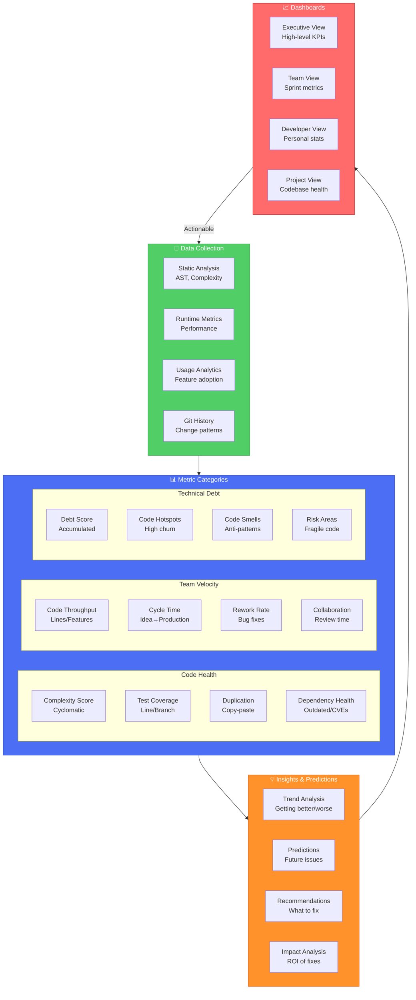

# Analytics System - Code Health & Team Metrics

## Overview

The Analytics System provides comprehensive insights into code health, team productivity, and system performance. It transforms raw data from the Ontology-LSP core into actionable intelligence that drives better decisions and continuous improvement.

## Core Concept: Measure Everything, Act on Insights

### Why Analytics Matter
- **Objective Decision Making**: Data-driven development choices
- **Early Problem Detection**: Identify issues before they become critical
- **Productivity Tracking**: Measure and improve team velocity
- **Quality Assurance**: Maintain high code standards
- **ROI Demonstration**: Prove the value of tools and practices

## Analytics Architecture



## Metric Categories

### 1. Code Health Metrics

#### Complexity Analysis
```typescript
interface ComplexityMetrics {
  cyclomatic: number;        // McCabe complexity
  cognitive: number;         // Cognitive complexity
  nesting: number;          // Maximum nesting depth
  parameters: number;       // Parameter count
  lines: number;           // Lines of code
  
  trend: "improving" | "stable" | "degrading";
  threshold: {
    warning: number;
    critical: number;
  };
}

// Example thresholds
const COMPLEXITY_THRESHOLDS = {
  cyclomatic: { warning: 10, critical: 20 },
  cognitive: { warning: 15, critical: 30 },
  nesting: { warning: 4, critical: 6 },
  parameters: { warning: 4, critical: 7 },
  lines: { warning: 50, critical: 100 }
};
```

#### Test Coverage
```typescript
interface CoverageMetrics {
  line: number;           // Line coverage %
  branch: number;         // Branch coverage %
  function: number;       // Function coverage %
  statement: number;      // Statement coverage %
  
  uncoveredFiles: string[];
  criticalUncovered: string[]; // High-risk uncovered code
  
  delta: {              // Change from last measurement
    line: number;
    branch: number;
    improving: boolean;
  };
}
```

#### Code Duplication
```typescript
interface DuplicationMetrics {
  percentage: number;     // % of duplicated code
  blocks: DuplicateBlock[];
  
  severity: {
    exact: number;       // Exact duplicates
    similar: number;     // Similar with variations
    structural: number;  // Same structure, different names
  };
}

interface DuplicateBlock {
  files: string[];
  lines: number;
  tokens: number;
  severity: "low" | "medium" | "high";
}
```

### 2. Team Velocity Metrics

#### Development Throughput
```typescript
interface ThroughputMetrics {
  commits: {
    daily: number;
    weekly: number;
    monthly: number;
  };
  
  linesChanged: {
    additions: number;
    deletions: number;
    net: number;
  };
  
  features: {
    completed: number;
    inProgress: number;
    velocity: number;    // Features per sprint
  };
  
  efficiency: {
    codeChurn: number;   // Rework rate
    firstTimeRight: number; // % code that doesn't need fixes
  };
}
```

#### Cycle Time Analysis
```typescript
interface CycleTimeMetrics {
  leadTime: Duration;        // Idea to production
  cycleTime: Duration;       // Start to finish
  codingTime: Duration;      // Active development
  reviewTime: Duration;      // Code review duration
  deployTime: Duration;      // Deployment duration
  
  bottlenecks: {
    stage: string;
    averageTime: Duration;
    recommendation: string;
  }[];
}
```

### 3. Technical Debt Metrics

#### Debt Calculation
```typescript
interface TechnicalDebtMetrics {
  score: number;            // Overall debt score (0-100)
  
  categories: {
    codeSmells: DebtItem[];
    outdatedDeps: DebtItem[];
    missingTests: DebtItem[];
    documentation: DebtItem[];
    security: DebtItem[];
  };
  
  estimation: {
    totalHours: number;     // Estimated fix time
    criticalHours: number;  // Critical items only
    costEstimate: number;   // Financial impact
  };
  
  trend: {
    daily: number;         // Debt change rate
    projection: number;    // Projected debt in 30 days
  };
}

interface DebtItem {
  file: string;
  issue: string;
  severity: "low" | "medium" | "high" | "critical";
  effort: number;          // Hours to fix
  impact: number;          // Business impact score
}
```

#### Code Hotspots
```typescript
interface HotspotAnalysis {
  hotspots: Hotspot[];
  
  riskMatrix: {
    highChangeHighComplexity: string[];  // Highest risk
    highChangeLowComplexity: string[];   // Refactor candidates
    lowChangeHighComplexity: string[];   // Stable but complex
    lowChangeLowComplexity: string[];    // Stable and simple
  };
}

interface Hotspot {
  file: string;
  changeFrequency: number;  // Changes per month
  complexity: number;
  bugFrequency: number;     // Bugs per month
  contributors: number;      // Number of contributors
  riskScore: number;        // Combined risk metric
}
```

## Dashboard Types

### 1. Executive Dashboard
High-level KPIs for management:

```typescript
interface ExecutiveDashboard {
  kpis: {
    velocity: TrendMetric;        // Team velocity trend
    quality: TrendMetric;         // Code quality score
    productivity: TrendMetric;    // Developer productivity
    security: SecurityScore;      // Security posture
  };
  
  costMetrics: {
    technicalDebt: number;       // $ value of debt
    productivityGain: number;    // $ saved from tools
    qualityROI: number;          // $ saved from bug prevention
  };
  
  predictions: {
    deliveryRisk: RiskLevel;     // Project delivery risk
    qualityTrend: Trend;         // Quality projection
    capacityForecast: number;    // Team capacity
  };
}
```

### 2. Team Dashboard
Sprint and team metrics:

```typescript
interface TeamDashboard {
  sprint: {
    velocity: number;
    burndown: BurndownChart;
    impediments: string[];
    completionRate: number;
  };
  
  collaboration: {
    reviewTurnaround: Duration;
    pairProgramming: number;    // Hours
    knowledgeSharing: number;   // Patterns shared
  };
  
  quality: {
    defectRate: number;
    testCoverage: number;
    codeReviewCoverage: number;
  };
  
  improvements: {
    suggestions: Improvement[];
    implemented: number;
    impact: ImpactMeasure;
  };
}
```

### 3. Developer Dashboard
Personal productivity metrics:

```typescript
interface DeveloperDashboard {
  personal: {
    commits: number;
    linesWritten: number;
    reviewsCompleted: number;
    patternsLearned: number;
  };
  
  quality: {
    bugRate: number;           // Bugs per 1000 lines
    codeQuality: QualityScore;
    testCoverage: number;
    documentationScore: number;
  };
  
  learning: {
    skillsImproved: Skill[];
    certificationsEarned: Certification[];
    patternsContributed: number;
    mentoringSessions: number;
  };
  
  recommendations: {
    focusAreas: string[];       // Areas to improve
    learningPaths: LearningPath[];
    toolSuggestions: Tool[];
  };
}
```

## Insight Generation

### Trend Analysis
```typescript
interface TrendAnalyzer {
  // Detect trends in metrics
  detectTrend(metric: Metric[], window: Duration): Trend;
  
  // Find correlations
  findCorrelations(metrics: Metric[]): Correlation[];
  
  // Identify anomalies
  detectAnomalies(metric: Metric[]): Anomaly[];
  
  // Seasonal patterns
  findSeasonality(metric: Metric[]): SeasonalPattern;
}

interface Trend {
  direction: "improving" | "stable" | "degrading";
  strength: number;          // 0-1
  confidence: number;         // Statistical confidence
  projection: Projection;     // Future prediction
}
```

### Predictive Analytics
```typescript
interface PredictiveAnalytics {
  // Predict future issues
  predictBugs(metrics: CodeMetrics): BugPrediction;
  
  // Estimate delivery
  estimateDelivery(velocity: VelocityMetrics): DeliveryEstimate;
  
  // Forecast debt
  forecastDebt(current: DebtMetrics): DebtForecast;
  
  // Risk assessment
  assessRisk(project: ProjectMetrics): RiskAssessment;
}

interface BugPrediction {
  likelihood: number;         // 0-1 probability
  estimatedCount: number;     // Predicted bug count
  riskAreas: string[];       // Files likely to have bugs
  preventionSteps: string[]; // Recommended actions
}
```

### Recommendation Engine
```typescript
interface RecommendationEngine {
  // Prioritize improvements
  prioritizeImprovements(metrics: AllMetrics): PrioritizedList;
  
  // Suggest refactorings
  suggestRefactorings(hotspots: Hotspot[]): RefactoringSuggestion[];
  
  // Team recommendations
  recommendTeamActions(team: TeamMetrics): TeamAction[];
  
  // Tool suggestions
  suggestTools(gaps: MetricGap[]): ToolSuggestion[];
}

interface PrioritizedList {
  critical: Action[];        // Do immediately
  high: Action[];           // Do this sprint
  medium: Action[];         // Do this quarter
  low: Action[];           // Nice to have
}
```

## Real-time Monitoring

### Live Metrics Stream
```typescript
interface LiveMetrics {
  // Real-time code changes
  codeChanges: Observable<CodeChange>;
  
  // Active development sessions
  activeSessions: Observable<DeveloperSession>;
  
  // Build/test results
  cicdEvents: Observable<CICDEvent>;
  
  // Performance metrics
  performanceMetrics: Observable<PerformanceMetric>;
}

interface CodeChange {
  timestamp: Date;
  developer: string;
  file: string;
  linesAdded: number;
  linesRemoved: number;
  complexity: ComplexityDelta;
}
```

### Alert System
```typescript
interface AlertSystem {
  rules: AlertRule[];
  
  // Alert when thresholds crossed
  thresholdAlerts: {
    metric: string;
    threshold: number;
    action: AlertAction;
  }[];
  
  // Pattern-based alerts
  patternAlerts: {
    pattern: string;
    detection: DetectionRule;
    severity: AlertSeverity;
  }[];
}

enum AlertSeverity {
  INFO = "info",
  WARNING = "warning",
  ERROR = "error",
  CRITICAL = "critical"
}
```

## Data Privacy and Security

### Privacy Controls
```typescript
interface PrivacyControls {
  // Anonymization
  anonymizeDeveloper: boolean;
  aggregationLevel: "individual" | "team" | "organization";
  
  // Data retention
  retentionPeriod: Duration;
  purgeSchedule: CronExpression;
  
  // Access control
  accessLevels: {
    executive: string[];     // Metric access
    team: string[];
    individual: string[];
  };
}
```

### Compliance
```typescript
interface ComplianceSettings {
  gdpr: {
    enabled: boolean;
    dataSubjectRights: boolean;
    consentTracking: boolean;
  };
  
  sox: {
    auditTrail: boolean;
    changeControl: boolean;
  };
  
  industry: {
    hipaa: boolean;
    pci: boolean;
    iso27001: boolean;
  };
}
```

## Integration with Other Pillars

### With Plugin System
- Plugins provide specialized metrics
- Analytics drive plugin recommendations
- Performance monitoring for plugins

### With Pattern Marketplace
- Track pattern effectiveness
- Measure pattern adoption
- Identify pattern opportunities

### With AI Training
- Provide training feedback
- Track model performance
- Identify areas needing AI help

## Success Metrics

### System Performance
- **Data Collection Rate**: >10,000 metrics/second
- **Dashboard Load Time**: <2 seconds
- **Alert Latency**: <30 seconds
- **Storage Efficiency**: <100MB/day/project

### Business Value
- **Decision Speed**: 50% faster with data
- **Issue Prevention**: 40% fewer production bugs
- **Productivity Gain**: 25% improvement
- **ROI**: 10x return on investment

### User Adoption
- **Daily Active Users**: 80% of developers
- **Dashboard Views**: >100/day/team
- **Action Rate**: 60% of recommendations acted on
- **Satisfaction Score**: >4.5/5

## Future Enhancements

### Advanced Analytics
- Machine learning for anomaly detection
- Natural language insights
- Automated root cause analysis
- Prescriptive analytics

### Integration Expansion
- IDE integration for real-time feedback
- CI/CD pipeline integration
- Project management tool sync
- Communication platform alerts

### Visualization Innovation
- AR/VR code visualization
- Interactive 3D metrics
- Real-time collaboration views
- Gamification elements

## Related Documentation

- [[ECOSYSTEM_ARCHITECTURE]] - Complete ecosystem overview
- [[PLUGIN_ARCHITECTURE]] - Analytics plugins
- [[PATTERN_MARKETPLACE]] - Pattern effectiveness metrics
- [[AI_TRAINING_PIPELINE]] - Model performance analytics
- [[VISION]] - Overall system vision