# Ecosystem Architecture - Complete Vision

## Overview

The Ontology-LSP Ecosystem Extensions create a self-reinforcing knowledge economy where code intelligence compounds through four interconnected pillars. This document provides the complete architectural vision with detailed visualizations.

## The Four Pillars of Ecosystem Extensions

### 1. Plugin System - Code Extensions
**What**: Executable code that extends core functionality  
**How**: Sandboxed runtime with capability-based security  
**Value**: New features, integrations, and language support  
**See**: [[PLUGIN_ARCHITECTURE]] for detailed implementation

### 2. Pattern Marketplace - Knowledge Sharing  
**What**: Learned patterns as tradeable data assets  
**How**: Export/import JSON/YAML pattern definitions  
**Value**: Team knowledge becomes intellectual property  
**See**: [[PATTERN_MARKETPLACE]] for marketplace design

### 3. AI Training - Custom Intelligence
**What**: Dataset generation from your codebase  
**How**: Extract, annotate, train, and deploy models  
**Value**: Team-specific AI assistance  
**See**: [[AI_TRAINING_PIPELINE]] for training architecture

### 4. Analytics - Insights & Metrics
**What**: Code health and team performance metrics  
**How**: Continuous analysis with trend detection  
**Value**: Data-driven decision making  
**See**: [[ANALYTICS_SYSTEM]] for metrics framework

## Complete Ecosystem Architecture

## The Four Pillars Comparison

```mermaid
graph TD
  subgraph ECOSYSTEM["🌐 ECOSYSTEM EXTENSIONS - Four Distinct Pillars"]
    subgraph P1["🔌 PLUGIN SYSTEM<br/>Code Extensions"]
      P1_WHAT["What: Executable code<br/>that extends functionality"]
      P1_HOW["How: Sandboxed runtime,<br/>capability-based security"]
      P1_VALUE["Value: New features,<br/>integrations, languages"]
      P1_EXAMPLE["Examples:<br/>• Rust language support<br/>• GitHub integration<br/>• Security scanner"]
    end
    
    subgraph P2["🎯 PATTERN MARKETPLACE<br/>Knowledge Sharing"]
      P2_WHAT["What: Learned patterns<br/>as data assets"]
      P2_HOW["How: Export/import<br/>JSON/YAML patterns"]
      P2_VALUE["Value: Team knowledge<br/>becomes tradeable"]
      P2_EXAMPLE["Examples:<br/>• Error handling patterns<br/>• Architecture blueprints<br/>• Refactoring recipes"]
    end
    
    subgraph P3["🤖 AI TRAINING<br/>Custom Intelligence"]
      P3_WHAT["What: Dataset generation<br/>from your code"]
      P3_HOW["How: Extract, annotate,<br/>train models"]
      P3_VALUE["Value: Team-specific<br/>AI assistance"]
      P3_EXAMPLE["Examples:<br/>• Completion models<br/>• Naming conventions<br/>• Code style models"]
    end
    
    subgraph P4["📊 ANALYTICS<br/>Insights & Metrics"]
      P4_WHAT["What: Code health<br/>and team metrics"]
      P4_HOW["How: Continuous analysis,<br/>trend detection"]
      P4_VALUE["Value: Data-driven<br/>decisions"]
      P4_EXAMPLE["Examples:<br/>• Tech debt tracking<br/>• Velocity metrics<br/>• Quality scores"]
    end
  end
  
  subgraph SYNERGY["✨ Synergistic Effects"]
    S1["Plugins discover patterns → Marketplace"]
    S2["Patterns train models → AI Training"]
    S3["AI generates insights → Analytics"]
    S4["Analytics identify needs → New Plugins"]
  end
  
  subgraph IMPACT["🚀 Combined Impact"]
    I1["Individual: Personal productivity"]
    I2["Team: Shared knowledge"]
    I3["Organization: Competitive advantage"]
    I4["Industry: Democratized expertise"]
  end
  
  P1 --> S1
  P2 --> S2
  P3 --> S3
  P4 --> S4
  
  SYNERGY --> IMPACT
  
  classDef plugin fill:#51cf66,stroke:#2f9e44,color:#fff
  classDef pattern fill:#845ef7,stroke:#5f3dc4,color:#fff
  classDef ai fill:#ff922b,stroke:#e8590c,color:#fff
  classDef analytics fill:#4c6ef5,stroke:#364fc7,color:#fff
  classDef synergy fill:#ffd43b,stroke:#fab005,color:#000
  classDef impact fill:#ff6b6b,stroke:#c92a2a,color:#fff
  
  class P1 plugin
  class P2 pattern
  class P3 ai
  class P4 analytics
  class SYNERGY synergy
  class IMPACT impact
```

## Pattern Marketplace vs Plugin System

## Ecosystem Synergy - Component Interactions

```mermaid
graph TB
  subgraph CORE["🧠 Intelligent Core"]
    LEARN["Learning System"]
    ANALYZE["Code Analyzer"]
    KNOWLEDGE["Knowledge Base"]
  end
  
  subgraph PLUGINS["🔌 Plugins"]
    P1["Enhanced Fuzzy Search"]
    P2["Security Scanner"]
    P3["Python Support"]
  end
  
  subgraph PATTERNS["🎯 Patterns"]
    PAT1["Error Handling"]
    PAT2["Auth Flow"]
    PAT3["API Design"]
  end
  
  subgraph AI["🤖 AI Training"]
    MODEL1["Completion Model"]
    MODEL2["Refactoring Model"]
    MODEL3["Naming Model"]
  end
  
  subgraph ANALYTICS["📊 Analytics"]
    METRIC1["Code Quality"]
    METRIC2["Team Velocity"]
    METRIC3["Tech Debt"]
  end
  
  %% Plugin interactions
  P1 -->|Improves| ANALYZE
  P2 -->|Generates| PAT2
  P3 -->|Enables| MODEL1
  
  %% Pattern interactions
  PAT1 -->|Trains| MODEL2
  PAT2 -->|Informs| P2
  PAT3 -->|Measures via| METRIC1
  
  %% AI interactions
  MODEL1 -->|Enhances| ANALYZE
  MODEL2 -->|Creates| PAT1
  MODEL3 -->|Tracked by| METRIC2
  
  %% Analytics interactions
  METRIC1 -->|Identifies need for| P2
  METRIC2 -->|Shows value of| PAT3
  METRIC3 -->|Prioritizes| MODEL2
  
  %% Core feeds everything
  LEARN -->|Discovers| PATTERNS
  ANALYZE -->|Uses| PLUGINS
  KNOWLEDGE -->|Trains| AI
  CORE -->|Measured by| ANALYTICS
  
  note["Each component enhances others:<br/>• Plugins generate patterns<br/>• Patterns train AI models<br/>• AI improves analytics<br/>• Analytics guide plugin development"]
  
  classDef ocean fill:#4c6ef5,stroke:#364fc7,color:#fff
  classDef forest fill:#51cf66,stroke:#2f9e44,color:#fff
  classDef grape fill:#845ef7,stroke:#5f3dc4,color:#fff
  classDef amber fill:#ff922b,stroke:#e8590c,color:#fff
  classDef coral fill:#ff6b6b,stroke:#c92a2a,color:#fff
  
  class CORE ocean
  class PLUGINS forest
  class PATTERNS grape
  class AI amber
  class ANALYTICS coral
```

## Key Principles

### 1. Separation of Concerns
- **Plugins**: Extend functionality through code
- **Patterns**: Share knowledge through data
- **AI Training**: Customize intelligence through models
- **Analytics**: Measure success through metrics

### 2. Self-Reinforcing Ecosystem
Each pillar strengthens the others:
- Plugins discover patterns → Feed marketplace
- Patterns train models → Improve AI
- AI generates insights → Enhance analytics
- Analytics identify gaps → Guide plugin development

### 3. Value Creation at Every Level
- **Individual**: Personal productivity gains
- **Team**: Shared knowledge and consistency
- **Organization**: Competitive advantage through proprietary patterns
- **Industry**: Democratized expertise through marketplace

### 4. Security & Performance First
- Plugins run in sandboxed environments
- Patterns are data-only (no executable code)
- AI models are validated before deployment
- Analytics respect privacy and performance budgets

## Implementation Roadmap

### Phase 1: Plugin System Foundation
- Core plugin manager with sandboxing
- Security framework and capability system
- Basic plugin types (layer, protocol, language)
- Plugin development kit (PDK)

### Phase 2: Pattern Marketplace
- Pattern export/import mechanisms
- Marketplace infrastructure
- Pattern validation and curation
- Trading and licensing system

### Phase 3: AI Training Pipeline
- Dataset generation from codebases
- Model training infrastructure
- Fine-tuning capabilities
- Model deployment and versioning

### Phase 4: Analytics Dashboard
- Metric collection framework
- Real-time dashboards
- Trend analysis and predictions
- Integration with other pillars

## Success Metrics

### Ecosystem Health
- Number of active plugins: Target 100+ in year 1
- Pattern submissions: 1000+ patterns monthly
- AI model accuracy: >85% for team-specific tasks
- Analytics adoption: 80% of teams using dashboards

### Value Generation
- Developer productivity: 30% improvement
- Code quality: 40% reduction in bugs
- Knowledge sharing: 5x increase in pattern reuse
- Time to market: 25% faster feature delivery

## Related Documentation

- [[PLUGIN_ARCHITECTURE]] - Detailed plugin system design
- [[PATTERN_MARKETPLACE]] - Pattern economy and trading
- [[AI_TRAINING_PIPELINE]] - Dataset generation and model training
- [[ANALYTICS_SYSTEM]] - Metrics and insights framework
- [[VISION]] - Overall system vision and philosophy