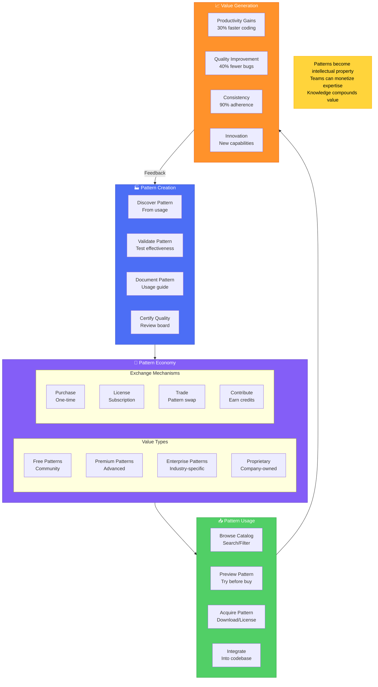

# Pattern Marketplace - Knowledge Economy

## Overview

The Pattern Marketplace transforms team knowledge into tradeable assets. Unlike the Plugin System which deals with executable code, the Pattern Marketplace focuses on sharing learned patterns, best practices, and architectural knowledge as data.

## Core Concept: Patterns as Intellectual Property

### What Are Patterns?
Patterns are structured knowledge representations that capture:
- **Coding Patterns**: Common solutions to recurring problems
- **Architectural Patterns**: Design decisions and structures
- **Refactoring Patterns**: Transformation recipes
- **Language Idioms**: Language-specific best practices
- **Error Handling**: Proven error management strategies
- **Security Patterns**: Authentication and authorization flows

### Pattern Format
Patterns are stored as data (JSON/YAML), not code:

```yaml
pattern:
  id: "error-handling-async-retry"
  name: "Async Operation with Exponential Backoff"
  category: "error-handling"
  language: ["typescript", "javascript"]
  
  description: |
    Retry failed async operations with exponential backoff
    and jitter to avoid thundering herd problems.
  
  context:
    problem: "Network operations can fail transiently"
    solution: "Implement retry with backoff"
    
  template:
    before: |
      async function fetchData(url) {
        return await fetch(url);
      }
    
    after: |
      async function fetchDataWithRetry(url, maxRetries = 3) {
        for (let i = 0; i < maxRetries; i++) {
          try {
            return await fetch(url);
          } catch (error) {
            if (i === maxRetries - 1) throw error;
            const delay = Math.min(1000 * Math.pow(2, i) + Math.random() * 1000, 10000);
            await new Promise(resolve => setTimeout(resolve, delay));
          }
        }
      }
  
  metrics:
    usage_count: 15234
    success_rate: 0.94
    avg_time_saved: "15 minutes"
  
  tags: ["async", "retry", "network", "resilience"]
  author: "team-alpha"
  license: "MIT"
  price: "free"
```

## Knowledge Economy Architecture



## Pattern Categories

### 1. Architectural Patterns
- Microservice communication patterns
- Event-driven architectures
- Domain-driven design structures
- API gateway patterns
- Database access patterns

### 2. Code Quality Patterns
- SOLID principle implementations
- Clean code patterns
- Testing strategies
- Documentation patterns
- Code review checklists

### 3. Performance Patterns
- Caching strategies
- Query optimization
- Lazy loading techniques
- Memory management
- Concurrency patterns

### 4. Security Patterns
- Authentication flows
- Authorization patterns
- Input validation
- Encryption strategies
- Secure communication

### 5. Team Patterns
- Git workflows
- CI/CD pipelines
- Code review processes
- Documentation standards
- Naming conventions

## Marketplace Features

### Discovery & Search
- **Semantic Search**: Find patterns by intent, not just keywords
- **Category Browse**: Explore by pattern type
- **Trending**: Popular and emerging patterns
- **Recommendations**: AI-powered suggestions based on your codebase

### Quality Assurance
- **Peer Review**: Community validation
- **Metrics**: Usage statistics and success rates
- **Ratings**: 5-star rating system
- **Certifications**: Expert-validated patterns

### Trading Mechanisms
- **Credits System**: Earn by contributing, spend by consuming
- **Subscription Tiers**: Monthly access to pattern categories
- **Enterprise Licensing**: Bulk access for organizations
- **Pattern Exchanges**: Trade your patterns for others

## Pattern Lifecycle

### 1. Discovery Phase
```typescript
// System automatically detects repeated patterns
interface PatternDiscovery {
  detectPatterns(codebase: Codebase): Pattern[];
  analyzeFrequency(pattern: Pattern): UsageMetrics;
  assessValue(pattern: Pattern): ValueScore;
}
```

### 2. Refinement Phase
```typescript
// Patterns are refined through usage
interface PatternRefinement {
  collectFeedback(pattern: Pattern, usage: Usage): Feedback;
  improvePattern(pattern: Pattern, feedback: Feedback[]): Pattern;
  validateImprovement(original: Pattern, improved: Pattern): boolean;
}
```

### 3. Publication Phase
```typescript
// Patterns are published to marketplace
interface PatternPublication {
  prepareForPublishing(pattern: Pattern): PublishablePattern;
  setLicensing(pattern: Pattern, terms: LicenseTerms): void;
  setPricing(pattern: Pattern, price: PricingModel): void;
  publish(pattern: PublishablePattern): MarketplaceEntry;
}
```

### 4. Consumption Phase
```typescript
// Patterns are consumed by users
interface PatternConsumption {
  search(query: SearchQuery): Pattern[];
  preview(pattern: Pattern): PreviewResult;
  acquire(pattern: Pattern, license: License): AcquiredPattern;
  integrate(pattern: AcquiredPattern, codebase: Codebase): void;
}
```

## Economic Models

### For Individual Developers
- **Earn Credits**: Contribute patterns, earn credits
- **Free Tier**: Access to community patterns
- **Pro Subscription**: $19/month for premium patterns
- **Pattern Sales**: Sell your patterns, keep 70% revenue

### For Teams
- **Team Pool**: Shared pattern library
- **Internal Marketplace**: Private pattern exchange
- **Team Subscription**: $99/month for 10 users
- **Custom Patterns**: Commission specific patterns

### For Enterprises
- **Enterprise License**: Unlimited access
- **Private Marketplace**: Internal pattern economy
- **Pattern Development**: Custom pattern creation service
- **Training & Support**: Pattern adoption assistance

## Integration with Other Pillars

### With Plugin System
- Plugins can generate patterns from usage
- Patterns can inform plugin development
- Plugins can automate pattern application

### With AI Training
- Patterns provide training data for models
- AI can discover new patterns
- Models can suggest pattern applications

### With Analytics
- Track pattern adoption and effectiveness
- Measure productivity improvements
- Identify pattern gaps and opportunities

## Implementation Considerations

### Pattern Storage
```typescript
interface PatternStorage {
  format: "JSON" | "YAML";
  versioning: SemanticVersion;
  compression: boolean;
  encryption: boolean;
  replication: ReplicationStrategy;
}
```

### Pattern Validation
```typescript
interface PatternValidation {
  schemaValidation(pattern: Pattern): ValidationResult;
  syntaxCheck(pattern: Pattern): SyntaxResult;
  semanticValidation(pattern: Pattern): SemanticResult;
  securityScan(pattern: Pattern): SecurityResult;
}
```

### Pattern Application
```typescript
interface PatternApplication {
  detectApplicability(pattern: Pattern, context: CodeContext): boolean;
  suggestApplication(pattern: Pattern, code: Code): Suggestion[];
  applyPattern(pattern: Pattern, code: Code): TransformedCode;
  validateApplication(before: Code, after: Code, pattern: Pattern): boolean;
}
```

## Success Metrics

### Marketplace Health
- Total patterns available: Target 10,000+ in year 1
- Active contributors: 1,000+ monthly
- Pattern downloads: 100,000+ monthly
- Revenue generated: $1M+ annually

### Pattern Quality
- Average rating: >4.2/5
- Successful applications: >85%
- Time saved per pattern: >15 minutes average
- Bug reduction: 40% in pattern-applied code

### Community Engagement
- Pattern submissions: 500+ monthly
- Reviews per pattern: >10 average
- Active discussions: 5,000+ monthly
- Pattern improvements: 20% monthly iteration

## Future Enhancements

### Pattern AI Assistant
- Natural language pattern search
- Automatic pattern application
- Pattern combination suggestions
- Custom pattern generation

### Pattern Certification Program
- Expert pattern reviewers
- Certified pattern badges
- Pattern quality standards
- Industry-specific certifications

### Global Pattern Exchange
- Cross-organization pattern sharing
- Industry pattern standards
- Open pattern protocols
- Pattern interoperability

## Related Documentation

- [[ECOSYSTEM_ARCHITECTURE]] - Complete ecosystem overview
- [[PLUGIN_ARCHITECTURE]] - Plugin system design
- [[AI_TRAINING_PIPELINE]] - How patterns train AI
- [[ANALYTICS_SYSTEM]] - Pattern effectiveness metrics
- [[VISION]] - Overall system vision