# Plugin Architecture Design

## Executive Summary

The Ontology-LSP Plugin System provides a secure, performant, and developer-friendly extension framework that allows third-party developers to enhance the core intelligence system without compromising security or performance.

## Core Philosophy

### Security-First Design
- **Sandboxed Execution**: All plugins run in isolated environments with limited system access
- **Permission-Based Security**: Explicit capability grants for file system, network, and core system access
- **Code Verification**: Static analysis and signature verification for all plugins
- **Resource Limits**: CPU, memory, and execution time constraints prevent abuse

### Performance Impact Minimization
- **Lazy Loading**: Plugins load only when needed
- **Resource Monitoring**: Track and limit plugin resource consumption
- **Performance Budgets**: Plugins must declare performance targets and respect system budgets
- **Fallback Mechanisms**: System continues operating even if plugins fail

### Developer Experience Excellence
- **TypeScript-First**: Full type safety and IntelliSense support
- **Hot Reloading**: Development-time plugin updates without restart
- **Comprehensive Documentation**: API docs, examples, and tutorials
- **Plugin Development Kit**: CLI tools and templates for rapid development

## Architecture Overview

```mermaid
graph TB
  subgraph CORE["🧠 Ontology-LSP Core (Protected)"]
    UA["Unified Analyzer"]
    LM["Layer Manager"] 
    SS["Shared Services"]
    LS["Learning System"]
  end

  subgraph PLUGIN_RUNTIME["🔐 Plugin Runtime Environment"]
    PM["Plugin Manager<br/>Loader, Registry, Lifecycle"]
    PS["Plugin Sandbox<br/>Isolated execution"]
    PA["Plugin API<br/>Controlled access"]
    PV["Plugin Validator<br/>Security checks"]
  end

  subgraph EXTENSION_POINTS["📌 Extension Points"]
    EP1["Layer Extensions<br/>Enhance existing layers"]
    EP2["New Layers<br/>Custom layer types"]
    EP3["Protocol Adapters<br/>New protocols"]
    EP4["Pattern Algorithms<br/>Learning enhancements"]
    EP5["Language Support<br/>New parsers"]
    EP6["External Integrations<br/>Tool connections"]
  end

  subgraph PLUGINS["🔌 Plugin Types"]
    LAYER_PLUGIN["Layer Plugin<br/>Enhance/Add layers"]
    PROTOCOL_PLUGIN["Protocol Plugin<br/>New adapters"]
    ANALYSIS_PLUGIN["Analysis Plugin<br/>Code intelligence"]
    LEARNING_PLUGIN["Learning Plugin<br/>Pattern algorithms"]
    INTEGRATION_PLUGIN["Integration Plugin<br/>External tools"]
  end

  CORE --> PLUGIN_RUNTIME
  PLUGIN_RUNTIME --> EXTENSION_POINTS
  EXTENSION_POINTS --> PLUGINS

  classDef core fill:#4c6ef5,stroke:#364fc7,color:#fff
  classDef runtime fill:#ff6b6b,stroke:#c92a2a,color:#fff
  classDef extension fill:#51cf66,stroke:#2f9e44,color:#fff
  classDef plugin fill:#845ef7,stroke:#5f3dc4,color:#fff

  class CORE core
  class PLUGIN_RUNTIME runtime
  class EXTENSION_POINTS extension
  class PLUGINS plugin
```



## Plugin Types and Extension Points

### 1. Layer Enhancement Plugins
Extend or replace existing processing layers (Layer 1-5):

**Example Use Cases:**
- Better fuzzy matching algorithms for Layer 1
- Advanced AST analysis for specific languages in Layer 2
- Custom concept relationship algorithms for Layer 3
- Novel pattern learning approaches for Layer 4
- Enhanced knowledge propagation for Layer 5

**API Surface:**
```typescript
interface LayerPlugin extends BasePlugin {
  type: 'layer';
  targetLayer: 'layer1' | 'layer2' | 'layer3' | 'layer4' | 'layer5';
  enhanceExisting: boolean; // true = enhance, false = replace
  process(input: LayerInput, context: LayerContext): Promise<LayerOutput>;
}
```

### 2. New Layer Plugins
Add entirely new processing layers beyond the core 5:

**Example Use Cases:**
- Layer 6: Code Quality Analysis
- Layer 7: Security Vulnerability Detection
- Layer 8: Performance Optimization Suggestions
- Layer 9: Documentation Generation

**API Surface:**
```typescript
interface NewLayerPlugin extends BasePlugin {
  type: 'newLayer';
  layerNumber: number; // 6+
  dependencies: string[]; // Required layers
  process(input: UnifiedInput, context: CoreContext): Promise<LayerOutput>;
}
```

### 3. Protocol Adapter Plugins
Add support for new communication protocols:

**Example Use Cases:**
- WebSocket real-time protocol
- GraphQL subscription interface
- gRPC service adapter
- Slack bot integration
- Discord bot integration

**API Surface:**
```typescript
interface ProtocolPlugin extends BasePlugin {
  type: 'protocol';
  protocolName: string;
  defaultPort?: number;
  initialize(core: CoreAnalyzer): Promise<ProtocolServer>;
}
```

### 4. Language Support Plugins
Add analysis support for new programming languages:

**Example Use Cases:**
- Rust language support
- Go language support
- Python enhanced analysis
- Java/Kotlin support
- C/C++ support

**API Surface:**
```typescript
interface LanguagePlugin extends BasePlugin {
  type: 'language';
  languageId: string;
  fileExtensions: string[];
  parser: LanguageParser;
  analyzer: LanguageAnalyzer;
}
```

### 5. External Integration Plugins
Connect to external tools and services:

**Example Use Cases:**
- GitHub integration
- Jira issue tracking
- Slack notifications
- Docker analysis
- CI/CD pipeline integration

**API Surface:**
```typescript
interface IntegrationPlugin extends BasePlugin {
  type: 'integration';
  serviceName: string;
  endpoints: EndpointConfiguration[];
  authenticate?(credentials: any): Promise<boolean>;
}
```

## Plugin Lifecycle Management

### 1. Discovery and Loading
```typescript
enum PluginLoadPhase {
  DISCOVERY = 'discovery',      // Find plugins in directories
  VALIDATION = 'validation',    // Security and compatibility checks
  INSTALLATION = 'installation', // Extract and prepare plugin
  INITIALIZATION = 'initialization', // Load and initialize
  REGISTRATION = 'registration',  // Register with core systems
  ACTIVATION = 'activation'      // Begin processing requests
}
```

### 2. Lifecycle Hooks
Every plugin implements standard lifecycle methods:

```typescript
interface PluginLifecycle {
  onLoad(context: PluginContext): Promise<void>;
  onInitialize(config: PluginConfig): Promise<void>;
  onActivate(): Promise<void>;
  onDeactivate(): Promise<void>;
  onUnload(): Promise<void>;
  onConfigChange(newConfig: PluginConfig): Promise<void>;
  onHealthCheck(): PluginHealthStatus;
}
```

### 3. State Management
Plugins maintain clear state transitions:

```typescript
enum PluginState {
  UNLOADED = 'unloaded',
  LOADING = 'loading',
  LOADED = 'loaded',
  INITIALIZING = 'initializing',
  READY = 'ready',
  ACTIVE = 'active',
  ERROR = 'error',
  DISABLED = 'disabled'
}
```

## Security Architecture

### 1. Capability-Based Security
Plugins declare required capabilities in their manifest:

```typescript
interface SecurityCapabilities {
  filesystem: {
    read: string[];      // Allowed read paths (glob patterns)
    write: string[];     // Allowed write paths
    execute: boolean;    // Can execute system commands
  };
  network: {
    outbound: string[];  // Allowed outbound hosts/ports
    inbound: boolean;    // Can accept inbound connections
  };
  system: {
    processAccess: boolean;   // Access to process information
    environmentAccess: boolean; // Access to environment variables
    coreApiAccess: string[];  // Core API methods
  };
  resources: {
    maxMemoryMB: number;     // Maximum memory usage
    maxCpuPercent: number;   // Maximum CPU usage
    maxExecutionTimeMs: number; // Maximum single operation time
    maxConcurrentOperations: number; // Concurrency limit
  };
}
```

### 2. Sandboxing Implementation
Plugins run in restricted environments:

- **Process Isolation**: Separate Node.js worker threads or child processes
- **File System Jail**: Restricted access to declared paths only
- **Network Filtering**: Proxy-based network access control
- **API Proxying**: All core system access through controlled APIs
- **Resource Monitoring**: Real-time tracking of resource consumption

### 3. Code Verification
Multi-layered security verification:

- **Static Analysis**: ESLint-based security rule scanning
- **Dependency Scanning**: Check for vulnerable dependencies
- **Signature Verification**: Cryptographic plugin signing
- **Runtime Monitoring**: Detect suspicious behavior patterns

## Plugin Development Kit (PDK)

### 1. CLI Tools
```bash
# Create new plugin from template
ontology-plugin create my-layer-plugin --type=layer --target=layer1

# Validate plugin before publishing
ontology-plugin validate ./my-plugin

# Test plugin in development environment
ontology-plugin test ./my-plugin --target-dir=/path/to/test-project

# Package plugin for distribution
ontology-plugin package ./my-plugin --output=my-plugin-v1.0.0.opl

# Publish to marketplace
ontology-plugin publish my-plugin-v1.0.0.opl --registry=https://plugins.ontology-lsp.dev
```

### 2. Development Templates
Pre-built templates for common plugin types:

- **Enhanced Layer Template**: Boilerplate for layer enhancement
- **New Layer Template**: Framework for custom layers
- **Protocol Adapter Template**: Base for new protocol support
- **Language Plugin Template**: Structure for language support
- **Integration Template**: Framework for external integrations

### 3. Testing Framework
Built-in testing utilities:

```typescript
import { PluginTestHarness } from '@ontology-lsp/plugin-testing';

describe('My Layer Plugin', () => {
  let harness: PluginTestHarness;

  beforeEach(async () => {
    harness = await PluginTestHarness.create({
      plugin: './dist/my-plugin.js',
      testProject: './test-fixtures/sample-project'
    });
  });

  test('enhances layer1 search performance', async () => {
    const result = await harness.testLayer('layer1', {
      identifier: 'myFunction',
      context: 'test-context'
    });
    
    expect(result.latency).toBeLessThan(5); // 5ms target
    expect(result.confidence).toBeGreaterThan(0.8);
  });
});
```

## Plugin Marketplace Infrastructure

### 1. Plugin Registry
Centralized plugin discovery and distribution:

**Features:**
- Searchable plugin catalog
- Version management and updates
- User ratings and reviews
- Download statistics and trending
- Security badge system
- Compatibility matrix

**Architecture:**
```typescript
interface PluginRegistryEntry {
  id: string;
  name: string;
  description: string;
  author: string;
  version: string;
  compatibility: {
    minCoreVersion: string;
    maxCoreVersion: string;
    requiredCapabilities: SecurityCapabilities;
  };
  metadata: {
    tags: string[];
    category: PluginCategory;
    downloadCount: number;
    rating: number;
    reviews: PluginReview[];
    securityBadge: SecurityBadge;
  };
  distribution: {
    downloadUrl: string;
    checksumSha256: string;
    signature: string;
    size: number;
  };
}
```

### 2. Plugin Marketplace UI
Web-based marketplace interface:

**Features:**
- Browse plugins by category
- Search and filter capabilities
- Plugin comparison tools
- Installation management
- Update notifications
- Security insights

### 3. Revenue Model
Support for commercial plugins:

**Options:**
- Free and open-source plugins
- One-time purchase plugins
- Subscription-based plugins
- Freemium model with premium features
- Enterprise licensing

## Version Compatibility Management

### 1. Semantic Versioning
Strict semver compliance:

- **Major Version**: Breaking API changes
- **Minor Version**: New features, backward compatible
- **Patch Version**: Bug fixes, fully compatible

### 2. Compatibility Matrix
Track compatibility across versions:

```typescript
interface CompatibilityMatrix {
  coreVersion: string;
  supportedPluginVersions: {
    [pluginId: string]: {
      minVersion: string;
      maxVersion: string;
      deprecated?: boolean;
      migrationGuide?: string;
    };
  };
}
```

### 3. Migration Support
Automated migration assistance:

- **Configuration Migration**: Update config formats automatically
- **API Changes**: Provide adapter layers for breaking changes
- **Deprecation Warnings**: Clear communication about upcoming changes
- **Migration Tools**: CLI utilities for bulk plugin updates

## Configuration and Settings

### 1. Plugin Configuration Schema
Standardized configuration format:

```typescript
interface PluginConfig {
  enabled: boolean;
  priority: number;        // Execution order
  timeout: number;         // Operation timeout
  retries: number;         // Retry attempts
  logging: {
    level: LogLevel;
    destination: string;
  };
  custom: Record<string, any>; // Plugin-specific settings
}
```

### 2. Runtime Configuration
Dynamic configuration updates:

```typescript
interface ConfigurationManager {
  getPluginConfig(pluginId: string): Promise<PluginConfig>;
  updatePluginConfig(pluginId: string, config: Partial<PluginConfig>): Promise<void>;
  watchConfigChanges(pluginId: string, callback: (config: PluginConfig) => void): void;
  validateConfig(config: PluginConfig, schema: JSONSchema): ValidationResult;
}
```

### 3. Environment-Specific Settings
Support for different environments:

- **Development**: Relaxed security, verbose logging, hot reloading
- **Testing**: Isolated execution, mock services, deterministic behavior  
- **Staging**: Production-like security, performance monitoring
- **Production**: Maximum security, minimal logging, optimized performance

## Performance Considerations

### 1. Plugin Performance Budgets
Each plugin type has performance constraints:

```typescript
interface PerformanceBudget {
  maxLatencyMs: number;        // Maximum single operation time
  maxMemoryMB: number;         // Maximum memory footprint
  maxCpuPercent: number;       // Maximum CPU usage
  maxConcurrentOps: number;    // Concurrency limit
  cacheHitRateMin: number;     // Minimum cache efficiency
}

const PLUGIN_BUDGETS: Record<PluginType, PerformanceBudget> = {
  layer: {
    maxLatencyMs: 50,
    maxMemoryMB: 100,
    maxCpuPercent: 25,
    maxConcurrentOps: 10,
    cacheHitRateMin: 0.8
  },
  protocol: {
    maxLatencyMs: 10,
    maxMemoryMB: 50,
    maxCpuPercent: 10,
    maxConcurrentOps: 100,
    cacheHitRateMin: 0.9
  }
  // ... other types
};
```

### 2. Performance Monitoring
Real-time plugin performance tracking:

```typescript
interface PluginPerformanceMetrics {
  pluginId: string;
  operationCount: number;
  averageLatency: number;
  p95Latency: number;
  p99Latency: number;
  errorRate: number;
  memoryUsage: number;
  cpuUsage: number;
  cacheHitRate: number;
  lastUpdated: number;
}
```

### 3. Performance Enforcement
Automatic performance issue handling:

- **Circuit Breaker**: Disable poorly performing plugins
- **Throttling**: Limit resource-heavy plugin operations
- **Degraded Mode**: Fall back to core functionality if plugins fail
- **Auto-scaling**: Adjust plugin concurrency based on load

## Backward Compatibility Strategy

### 1. API Versioning
Multiple API versions supported simultaneously:

```typescript
interface PluginAPI {
  v1: PluginAPIv1;    // Legacy support
  v2: PluginAPIv2;    // Current stable
  v3: PluginAPIv3;    // Beta/preview
}
```

### 2. Migration Path
Clear upgrade process:

1. **Deprecation Notice**: 6 months advance warning
2. **Migration Guide**: Step-by-step upgrade instructions
3. **Compatibility Layer**: Temporary adapter for old APIs
4. **Tool Support**: Automated migration utilities
5. **Community Support**: Forums and documentation

### 3. Legacy Plugin Support
Maintain compatibility with older plugins:

- **API Adapters**: Translate between API versions
- **Feature Polyfills**: Provide missing functionality
- **Security Updates**: Patch vulnerabilities in old versions
- **Performance Optimization**: Optimize legacy code paths

## Success Metrics and KPIs

### 1. Adoption Metrics
- Plugin marketplace monthly active users
- Number of published plugins
- Plugin download statistics
- Developer registration growth

### 2. Quality Metrics
- Average plugin security score
- Plugin performance compliance rate
- User satisfaction ratings
- Bug report resolution time

### 3. System Health Metrics
- Core system performance impact
- Plugin-related error rates
- Resource consumption by plugins
- System stability metrics

## Implementation Roadmap

### Phase 1: Foundation (Weeks 1-2)
- Core plugin manager implementation
- Basic security framework
- Plugin API interfaces
- Development tooling

### Phase 2: Security & Performance (Weeks 3-4)
- Sandboxing implementation
- Resource monitoring
- Performance budgets
- Security validation

### Phase 3: Developer Experience (Weeks 5-6)
- Plugin development kit
- Testing framework
- Documentation site
- Example plugins

### Phase 4: Marketplace (Weeks 7-8)
- Plugin registry
- Web marketplace UI
- Distribution system
- Community features

This plugin architecture transforms Ontology-LSP from a static system into a vibrant, extensible ecosystem while maintaining the core principles of security, performance, and developer experience excellence.